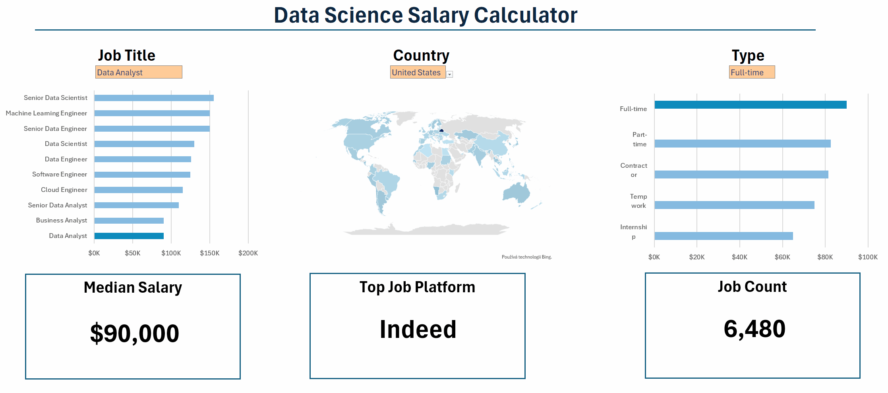

# Excel Salary Dachboard

## Introduction
An interactive Excel dashboard designed to help job seekers explore salary ranges for different roles and verify whether they are being fairly compensated.  
The data contains detailed information on job, salaries, locations, and essential skills that are represented here.

## Dashboard File

My final dashboard is in [(Dashboard.xlsx)](Dashboard.xlsx)

## Excel Skills Used
The following Excel skills were utilized for analysis:

- Charts
- Formulas and Functions
- Data Validation

## Data Jobs Dataset
The dataset used for this project contains real-world data science job information from 2023. It is available in Luke Barousses Excel Course for Data Analytics, which provides a foundation for analyzing data using Excel. It includes detailed information on:

- Job titles
- Salaries
- Location
- Skills

## Dashboard Build

 - ### Charts

 ### Data Science Job Salaries - Bar Chart

 