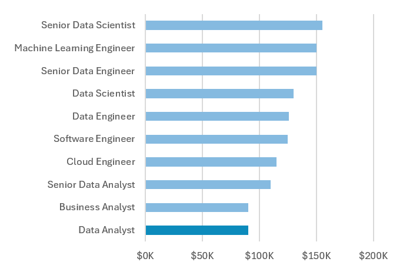
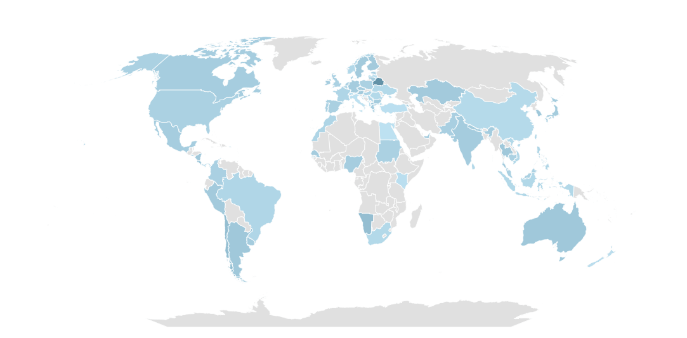
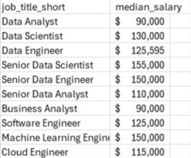
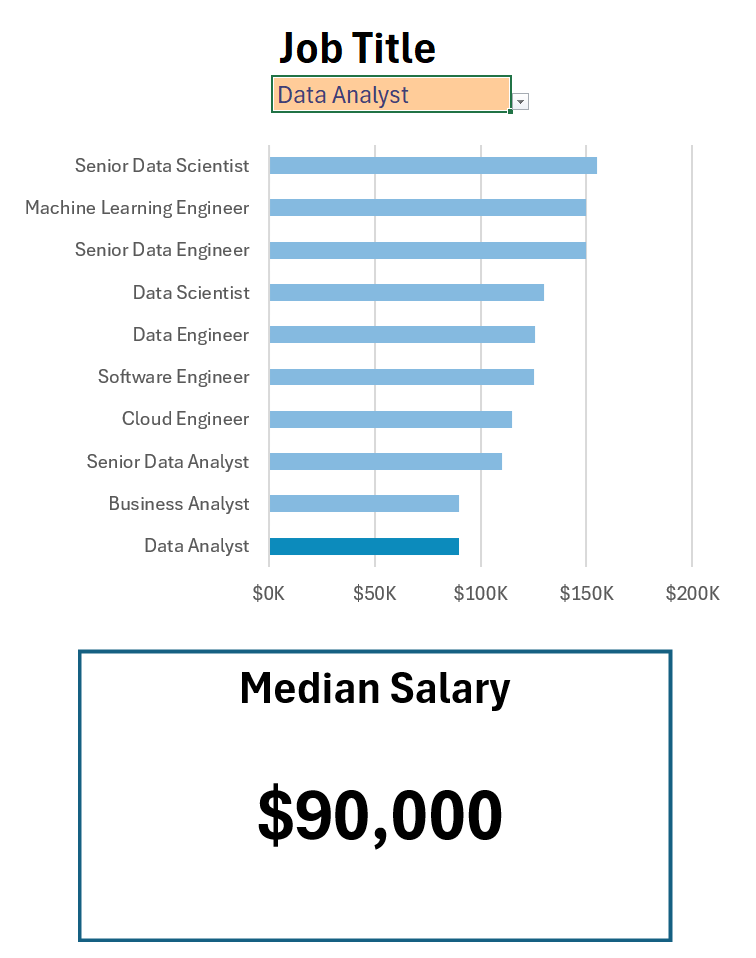
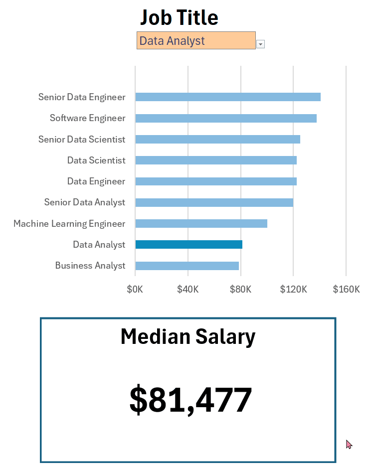

# Excel Salary Dachboard

## Introduction
An interactive Excel dashboard designed to help job seekers explore salary ranges for different roles and verify whether they are being fairly compensated.  
The data contains detailed information on job, salaries, locations, and essential skills that are represented here.

## Dashboard File

My final dashboard is in [(Dashboard.xlsx)](Dashboard.xlsx)

## Excel Skills Used
The following Excel skills were utilized for analysis:

- Charts
- Formulas and Functions
- Data Validation

## Data Jobs Dataset
The dataset used for this project contains real-world data science job information from 2023. It is available in Luke Barousses Excel Course for Data Analytics, which provides a foundation for analyzing data using Excel. It includes detailed information on:

- Job titles
- Salaries
- Location
- Skills

## Dashboard Build

 - ### Charts

 #### Data Science Job Salaries - Bar Chart

 
 
 #### Country Median Salaries - Map Chart

 
Enables quick grasp of global salary disparities and highlighs high/low salary regions.

 - ### Formulas and Functions

`
=MEDIAN(
  IF(
    (jobs[job_title_short]=A2)*
    (jobs[job_country]=country)*
    (ISNUMBER(SEARCH(type, jobs[job_schedule_type])))*
    (jobs[salary_year_avg]>0),
    jobs[salary_year_avg]
  )
)
`
- Multi-Criteria Filtering: Checks job title, country, schedule type, and exclude blank salaries.
- Arraye Formula: Utilizes `MEDIAN()` function with nested `IF()` statement to analyze an array. 
- Tailored Insights: Provides specific salary information for job titles, regions, and schedule types.
- Formula Purpose: This formula popultes the table below, returning the median salary based on job title, country, and type specified. 

#### Background Table

#### Dashboard Implementation

 - ### Data Validation

### 🔍 Filtered List

- **Enhanced Data Validation**: Implementing the filtered list as a data validation rule under the `Job Title`, `Country`, and `Type` option in the Data tab ensures:
  - User input is restricted to predefined, validated schedule types
  - Incorrect or inconsistent entries are prevented
  - Overall usability of the dashboard is enhanced

## Conclusion

I developed this dashboard to highlight salary trends across various data-related job titles. Exploring its features also provides insights into how location and job type impact salaries.
