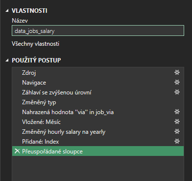
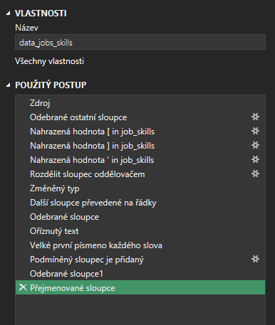
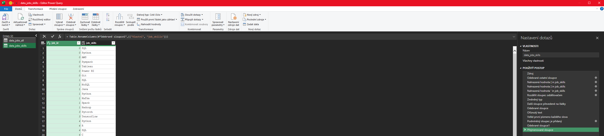
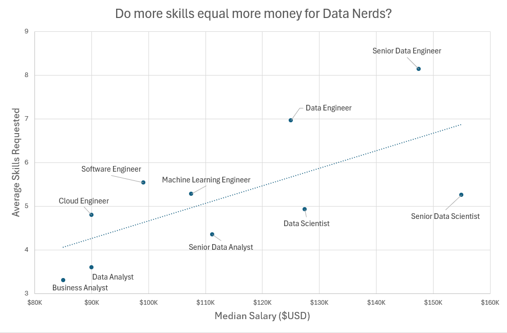

# Introduction

As a job seeker, I was very courious about salararies in data science. I set out to understand what skills top employers request and how to land more pay.

## Questions to Analyze

To understand the data science job market, I asked the following:
1. Do more skills get you better pay?
2. What's the salary for data jobs in different regions?
3. What are the top skills of data professionals?
4. What's the pay for the top 10 skills?

## Excel Skills Used

The following Excel skills were utilized for analysis:
- Pivot Tables
- Pivot Charts
- DAX (Data Analysis Expressions)
- Power Query
- Power Pivot

### 1. Do more skills get you better pay?

#### Skill: Power Query (ETL)

#### Extract
- I first used Power Query to extract the original data (data_salary_all.xlsx) and create two queries:
  - First one with all the data jobs information.
  - The second listing the skills for each job ID.

#### Transform
- Then, I transformed each query by changing column types, removing unnecessary columns, cleaning text to eliminate specific words, and trimming excess whitespace.

  - data_jobs_all  
  

  - data_job_skill  
  

#### Load 
- Finaly, I loaded both transform queries into the workbook, setting the foundation fro my subsequent analysis.

  - data_jobs_all
  

  - data_jobs_skills
  

## Analysis

### Insights
- There is a positive correlation between the number of skills requested in job postings and the median salary, particularly in roles like Senior Data Engineer and Data Scientist.
- Roles that require fewer skills, like Business Analyst, tend to offer lower salaries, suggesting that more specialized skill sets command higher market value.

