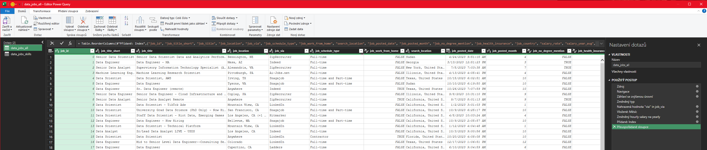

# Introduction

As a job seeker, I was very courious about salararies in data science. I set out to understand what skills top employers request and how to land more pay.

## Questions to Analyze

To understand the data science job market, I asked the following:
1. Do more skills get you better pay?
2. What's the salary for data jobs in different regions?
3. What are the top skills of data professionals?
4. What's the pay for the top 10 skills?

## Excel Skills Used

The following Excel skills were utilized for analysis:
- Pivot Tables
- Pivot Charts
- DAX (Data Analysis Expressions)
- Power Query
- Power Pivot

### 1. Do more skills get you better pay?

#### Skill: Power Query (ETL)

#### Extract
- I first used Power Query to extract the original data (data_salary_all.xlsx) and create two queries:
  - First one with all the data jobs information.
  - The second listing the skills for each job ID.

#### Transform
- Then, I transformed each query by changing column types, removing unnecessary columns, cleaning text to eliminate specific words, and trimming excess whitespace.

  - data_jobs_all  
  

  - data_job_skill  
  

#### Load 
- Finaly, I loaded both transform queries into the workbook, setting the foundation fro my subsequent analysis.

  - data_jobs_all
  

  - data_jobs_skills
  

## Analysis

### Insights
- There is a positive correlation between the number of skills requested in job postings and the median salary, particularly in roles like Senior Data Engineer and Data Scientist.
- Roles that require fewer skills, like Business Analyst, tend to offer lower salaries, suggesting that more specialized skill sets command higher market value.

### 2. What's the salary for data jobs in different regions?

### Skill: Pivot Tables & DAX
#### Pivot Tabel
 - I created a PivotTable using the Data Model I created with Power Pivot.
  - I moved the `job_title_short` to the rows area and `salary_year_avg` into the values area.
   - Then I added new measure to calculate the median salary for United States jobs.  
  `=CALCULATE(
    MEDIAN(data_jobs_all[salary_year_avg]),
    data_jobs_all[job_country] = "United States")`

🔍 DAX
• To calculate the median year salary I used DAX.  
`Median Salary := MEDIAN(data_jobs_all[salary_year_avg])`
#### Analysis
• Job roles like Senior Data Engineer and Data Scientist command higher median salaries both in the US and internationally, showcasing the global demand for high-level data expertise.

• The salary disparity between US and Non-US roles is particularly notable in high-tech jobs, which might be influenced by the concentration of tech industries in the US.

### Insights
- These salary insights are important for planning and salary negotiations, helping professionals and companies align their offers with market standards while considering geographical variations.

### 3. What are the top skills of data professionals?

### Skill: Power Pivot

### Power Pivot

• I created a data model by integrating the data_jobs_all and data_jobs_skills tables into one model.  
• Since I had already cleaned the data using Power Query, Power Pivot created a relationship between these two tables.  
### Data Model  
  • I created a relationship between my two tables using the job_id column.

### Power Pivot Menu
 - The Power Pivot menu was used to refine my data model and makes it easy to create measures.  

### Analysis
 - SQL, Excel, Python and Tableau/Power BI are the leading skills for data-analyst jobs worldwide, highlighting their essential role in data processing and analysis.   
 

### Insights
- Recognizing prevalent skills in the industry enables professionals to remain competitive and helps steer training and educational programs toward the most impactful technologies.

### 4. What's the pay for the top 10 skills?

### Skill: Advanced Charts (Pivot Chart)
- I created a combo PivotChart to plot median salary and skill likelihood (%) from my PivotTable.
  - Primary Axis: Median Salary (as a Clustered Column)
  - Secondary Axis: Skill Likelihood (as a Line with Markers)
- To customize the chart, I added a title axis title, removed the lines (skill likelihood), and changed the markers to diamonds.

### Analysis

- Higher median salaries are associated with skills like Python, Oracle, and SQL, suggesting their critical role in high-paying tech jobs.

- Skills like PowerPoint and Word have the lowest median salaries and likelihood, indicating less specialization and demand in high-salary sectors.

### Insights
- This chart highlights the importance of investing time in learning high-value skills like Python and SQL, which are evidently tied to higher paying roles, especially for those looking to maximize their salary in the tech industry.

## Conclusion

This Excel-based project analyzes real data science job postings to uncover trends in salaries, locations, and required skills. Using Power Query, PivotTables, and charts, it highlights how Python, SQL, and cloud technologies are strongly linked to higher-paying roles. It serves as a quick reference for data professionals seeking to focus on the most valuable skills.