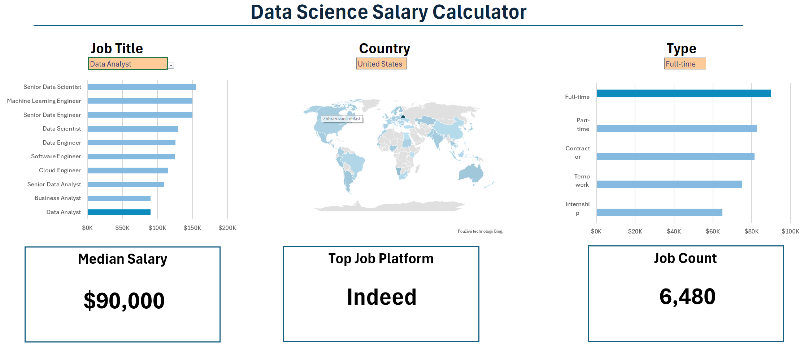
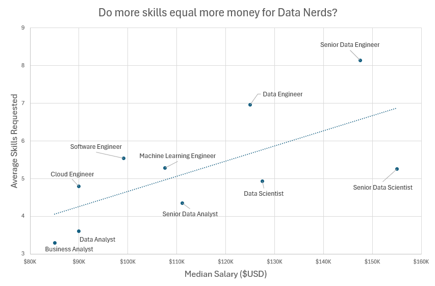
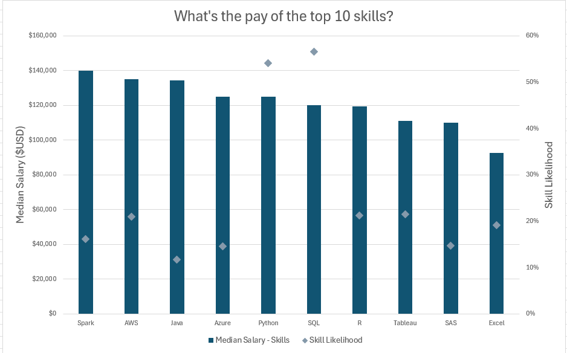

# My Excel Data Analytics Portfolio

Welcome!  
This repository contains all the Excel files I created while learning and practicing data analytics. Each project focuses on solving a specific problem and demonstrates key Excel skills for analyzing and visualizing data.

## 1. Salary Dashboard
An interactive Excel dashboard designed to help job seekers explore salary ranges for different roles and verify whether they are being fairly compensated.  
[Check out my work here](Project_1-Dashboard)

## 2. Salary Analysis
An exploratory analysis of job market data to identify the most valuable skills, optimal career paths, and strategies to increase earning potential.  
[Check out my work here](Project_2-Analysis)

---

### About
This portfolio is part of my journey into data analytics. It showcases my ability to clean, analyze, and visualize data in Excel, preparing me for more advanced tools and real-world projects.
